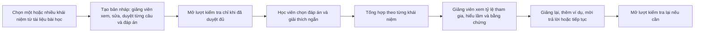

# CP2 — Luồng kiểm tra mức hiểu của lớp · Growup · A2

## Bài nộp

- Đội: Growup · 3B · E403.
- Đề tài: tính năng mới đề xuất cho VLearn, giúp giảng viên biết chỗ lớp chưa theo kịp sau một phần bài học.
- Mức prototype(bản mẫu): Mock(mô phỏng), chạy trong một cửa sổ và chuyển vai giảng viên/học viên.
- Bản mẫu: codebase/index.html. Mở trực tiếp bằng trình duyệt hoặc chạy `node codebase/server.cjs`, rồi truy cập http://127.0.0.1:4173.
- Bản mẫu công khai: https://hoanghuy12351.github.io/K4-3B-E403-Growup/
- Kho mã bản đã triển khai: https://github.com/hoanghuy12351/K4-3B-E403-Growup/tree/codex/cp2-pages
- Phiên bản đã triển khai — commit(bản lưu thay đổi): `3f4b76cd161a9cdf2b4ddae5b100834ffc82e8ad`.
- Nguồn GitHub Pages(dịch vụ lưu trang web): nhánh `codex/cp2-pages`, thư mục gốc. Nhánh này chỉ chứa giao diện bản mẫu, không có dữ liệu đề bài.

## Luồng chính

## Kịch bản trình diễn khoảng 1 phút

1. Mở trang, chọn các khái niệm cần kiểm tra; giữ lớp mẫu 16 người và tình huống 11 phản hồi giả lập. Bấm **Tạo bản nháp và duyệt câu hỏi**.
2. Xem câu hỏi, lựa chọn, đáp án đúng, tiêu chí và đoạn nguồn. Xác nhận từng câu rồi bấm **Mở kiểm tra đã duyệt**. Không duyệt đủ thì nút mở bị khóa.
3. Ở vai học viên, bấm **Điền ví dụ có một hiểu lầm** rồi **Gửi câu trả lời**. Nếu giữ nguyên bộ mẫu, thấy 12/16 người đã trả lời; mở **Xem bằng chứng và tiêu chí**.
4. Nếu chọn khái niệm kiểm chứng thông tin, xem lời giải thích của học viên thử và xác nhận nếu đáp ứng tiêu chí.
5. Bấm **Chọn cách dạy tiếp**, chọn giảng lại hoặc thêm ví dụ, ghi chú và **Lưu quyết định**.
6. Bấm **Bắt đầu lượt thử mới** để minh họa một lượt kiểm tra tiếp theo. Bản mẫu chưa so sánh kết quả hai lượt.

## Luồng bổ sung để xác minh

- Ít người trả lời: ở bảng tổng hợp chọn **Ít người trả lời**, bấm **Tổng hợp lại**. Bản mẫu báo chưa đủ dữ liệu, không suy luận mức hiểu của toàn lớp.
- Chưa ai trả lời: chọn **Chưa có phản hồi**, bấm **Tổng hợp lại**. Không hiển thị 0% như thể toàn lớp không hiểu.
- Lỗi: chọn **Lỗi tổng hợp**, bấm **Tổng hợp lại**. Ẩn bảng cũ, cho xem lại câu trả lời hoặc đổi tình huống và thử lại.
- Sửa: bấm **Sửa câu trả lời thử**, đổi lựa chọn rồi gửi lại. Không đếm người đó thành một học viên mới, bỏ xác nhận cũ để giảng viên kiểm lại.

## Phần thật và phần mô phỏng

| Phần | Trạng thái CP2 |
|---|---|
| Nút bấm, chuyển màn hình, biểu mẫu, cập nhật đáp án, xác nhận của giảng viên | Chạy thật trong trình duyệt |
| Chọn một hoặc nhiều khái niệm từ hai phần mẫu | Chạy thật; câu hỏi và bảng kết quả chỉ chứa phạm vi đã chọn |
| Giảng viên xem/sửa câu hỏi, hai lựa chọn, đáp án và tiêu chí, duyệt từng câu | Chạy thật; sửa thì bỏ duyệt câu đó và đóng lượt thử cũ |
| 11 phản hồi của lớp | Dữ liệu giả lập tự soạn, không phải người dùng thật |
| Phân loại đáp án lựa chọn | Quy tắc cố định theo đáp án mẫu, chưa gọi AI |
| Đánh giá ý nghĩa lời giải thích | Chưa tự động; giảng viên xem và xác nhận thủ công |
| Nguồn nội dung | Ba đoạn nhóm tự soạn, mã GU-M01–GU-M03; hiện chưa nhập tệp hoặc kết nối tài liệu VLearn |
| Ngưỡng tham gia 50% | Cấu hình minh họa; chưa phải ngưỡng chất lượng dự án đã chốt |
| Kết nối VLearn, nhiều thiết bị, đăng nhập, lưu dữ liệu lâu dài | Chưa có; tải lại trang sẽ mất lượt thử |
| So sánh trước/sau giảng lại | Chưa có ở CP2 |

Nếu giảng viên sửa bất kỳ câu hỏi/đáp án/tiêu chí, bản mẫu chỉ dùng câu trả lời thử, không ghép 11 phản hồi giả lập của bộ câu cũ.

## Nguồn bài học khi làm thật

Luồng dự kiến: giảng viên chọn bài trên VLearn → lấy slide/bản chép lời của bài được phép sử dụng → xác định các phần và mã trang/đoạn → chọn phạm vi → AI tạo câu hỏi có nguồn và đáp án → giảng viên xem, sửa, duyệt → mở kiểm tra.

Trong hackathon có thể xử lý cục bộ tài liệu ở `data/vlearn-pack/transcript/` và `data/vlearn-pack/slides/` để xây nguồn. Không đưa nguyên bộ dữ liệu đề bài lên kho công khai. Hội thoại dùng tìm hiểu lầm và xây bộ thử, không thay thế tài liệu bài học làm nguồn xác định kiến thức đúng.

## Việc còn lại trước khi nộp

- [ ] Nhóm bấm thử luồng chính và quay màn hình nếu muốn dùng video làm bài nộp.
- [x] Lưu bản mẫu thành một phiên bản trong kho mã nộp bài, nhánh triển khai riêng.
- [x] Kiểm tra bản mẫu truy cập công khai và điền đường dẫn/mã phiên bản thực tế ở trên.
- [ ] Không đưa nguyên thư mục dữ liệu đề bài lên kho công khai.
- [ ] Đội trưởng nộp biểu mẫu CP2 theo thông báo ban tổ chức trước **21:00 ngày 17/09**.

## Xác minh bản mẫu tại máy ngày 17/09

- Đã bấm thử luồng chính từ mở kiểm tra đến lưu quyết định trên trình duyệt.
- Đã xác minh ít phản hồi và không có phản hồi hiển thị cảnh báo đúng, không kết luận toàn lớp chưa hiểu.
- Đã thử lỗi tổng hợp rồi phục hồi, giữ được câu trả lời thử.
- Đã sửa và gửi lại câu trả lời: tổng vẫn là 12/16, kết quả khái niệm thay đổi, xác nhận cũ được bỏ.
- Đã xác minh giảng viên xem lại câu 3 cập nhật kết quả.
- Đã mở lượt mới: xóa câu trả lời cũ và trạng thái xác nhận.
- Kiểm tra cú pháp JavaScript bằng Node.js đạt. Đây là xác minh luồng CP2, không phải kết quả đo chất lượng AI hoặc dùng thử với người ngoài nhóm.
- GitHub báo trang và lượt dựng ở trạng thái `built`, đúng mã phiên bản ở trên, không có lỗi dựng.
- Đã mở đường dẫn HTTPS công khai và thử mở kiểm tra → gửi câu trả lời → xem bảng tổng hợp; không có lỗi JavaScript trong trình duyệt.
- Bản cập nhật đã thử chọn hai khái niệm từ hai phần: có đúng hai câu hỏi và hai thẻ kết quả.
- Đã thử không chọn khái niệm: khóa tạo bản nháp; đổi phạm vi đóng lượt thử cũ, không đi tắt vào bài chưa duyệt.
- Đã thử duyệt thiếu, duyệt đủ, sửa sau khi duyệt và duyệt lại; học viên nhận đúng câu đã sửa.
- Đã thử câu hỏi sửa chỉ có một phản hồi thử, không ghép dữ liệu giả lập cũ.
- Bản cập nhật chọn phạm vi và duyệt câu hỏi đã dựng thành công trên GitHub Pages đúng mã phiên bản mới; đã thử lại luồng hai khái niệm trên đường dẫn công khai, không có lỗi trình duyệt.

## Phân công tiếp nối sang CP3

- Võ Huy Hoàng: phỏng vấn lab coach(người hướng dẫn thực hành), bằng chứng và đặc tả.
- Bùi Quang Vinh: câu kiểm tra, tiêu chí chấm và ít nhất 20 ca kiểm thử.
- Lê Trọng Khánh: thay phần phân tích mô phỏng bằng lời gọi AI thật có căn cứ.
- Đỗ Hoàng Quân: giao diện, dùng thử và quay video 30 giây.
